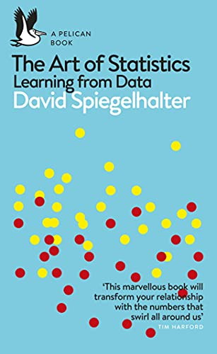
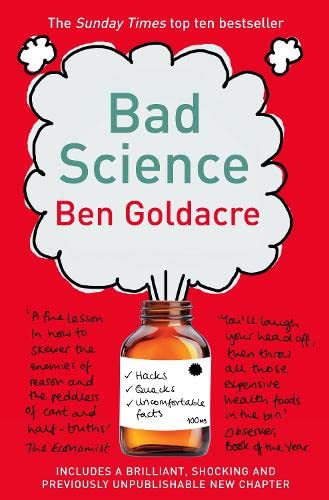

class: inverse, center, middle

```{css, echo=FALSE} 
@media print { # print out incremental slides; see https://stackoverflow.com/questions/56373198/get-xaringan-incremental-animations-to-print-to-pdf/56374619#56374619
  .has-continuation {
    display: block !important;
  }
}
```


.wide-container[
<div align="center">


</div>
]


---
class: inverse, center, middle

.wide-container[
<div align="center">

</div>
]


---
class: inverse

# What those books are about


--

.pull-left[

**Critical Thinking Detective**

<i>"This colorful 32-page book offers a collection of fun, easy-to-use detective cases for Grades 4–12+. Some cases may be more challenging for younger students, but teachers and parents can always provide hints when needed. The cases <mark>develop critical thinking skills</mark> by requiring students to read carefully and <mark>analyze and synthesize information to guide their decision-making</mark>. The cases also develop observation skills, reading comprehension, deductive and inductive thinking skills. The ability to identify and evaluate evidence is the very heart of critical thinking."</i>
]

--

.pull-right[

**The Sherlock Holmes Case Book**

<i>"Join the world's greatest fictional detective and use your own powers of deduction to solve these puzzling mysteries. The Sherlock Holmes Case Book: Solve-It-Yourself Mysteries is a remarkable collection of crimes from Dr John Watson's case notes that features all of the twists and turns that have come to be expected from a Holmes case – but now it is up to you to solve them.

There are 10 cases to be cracked, each of which <mark>requires the reader to use logic and powers of perception to answer a question at three points – the beginning, the middle and the end</mark>."</i>
]


---
class: inverse, center, middle

# The idea

<html><div style='float:left'></div><hr color='#EB811B' size=1px style="width:1000px; margin:auto;"/></html>


---
# 1-minute elevator pitch

<br><br>

--

1. An interactive mystery solving book

--

2. But with science puzzles

--

3. Every puzzle case describes a study with key features (research question, design, evidence in form of text, tables, and/or visuals, and *flawed* conclusions)

--

4. Answering a set of questions, readers have to find out what went wrong

--

5. On their way, readers learn to apply the scientific method and value high vs. low quality evidence


---
class: inverse, center, middle

# The market (gap)

<html><div style='float:left'></div><hr color='#EB811B' size=1px style="width:1000px; margin:auto;"/></html>

---
# What's out there (1)

.pull-left-center[

<div align="center">
<br>





</div>
]

--

.pull-right-center[

<br><br>

- There's plenty supply of rigorous, modern, and entertaining textbooks on causal inference and applied stats. 

- Most of them are clearly designed for an academic audience though.

- Difficult to digest without further knowledge or accompanying course.
]


---
# What's out there (2)

.pull-left-center[

<div align="center">
<br>





</div>
]

--

.pull-right-center[

<br><br>

- Moreover, there's plenty supply of good (and bad) airport literature on "new science", "bad science", or how various biases affect human decision-making.

- They're (also) targeting a non-academic audience.

- My hunch is that the learning effect of reading those books is limited, also because reading them is a largely passive experience.
]


---
# What's missing

.pull-left-center[

<br><br>

- A learning resource that trains a non-academic audience in spotting key flaws in published studies

- A way for non-academics who engage with scientific evidence (journalists, practitioners, interested public, policymakers - a non-academic audience) to apply the basics of the scientific method

- Something that is suitable for self-study, interactive learning, entertainment
]

.pull-right-center[

]


---
# What's missing

.pull-left-center[

<br><br>

- A learning resource that trains a non-academic audience in spotting key flaws in published studies

- A way for non-academics who engage with scientific evidence (journalists, practitioners, interested public, policymakers - a non-academic audience) to apply the basics of the scientific method

- Something that is suitable for self-study, interactive learning, entertainment

- Wait a minute... this already exists!

]

--

.pull-right-center[
<div align="center">

</div>
]


---
# Rival hypothesis (1979)

.wide-container[
<div align="center">
<br>


</div>
]


---
# Rival hypothesis (1979)

<div align="center">
<br>

</div>


---
class: inverse, center, middle

# The idea in more detail

<html><div style='float:left'></div><hr color='#EB811B' size=1px style="width:1000px; margin:auto;"/></html>


---
# Motivation

.pull-left-center[
<br><br>

- Teaching material for courses on causal inference

- Teaching material for data science workshops with professionals (EMPA: Mark's "When to Believe the Numbers: Informed Consumption of Quantitative Research; ExEd)

- Intervention material: Boosting evidence-based decision-making in public policy
]

.pull-right-center[
<div align="center">
<br><br><br>

</div>
]

---
# Motivation

.pull-left-center[
<br><br>

- Teaching material for courses on causal inference

- Teaching material for data science workshops with professionals (EMPA: Mark's "When to Believe the Numbers: Informed Consumption of Quantitative Research; ExEd)

- Intervention material: Boosting evidence-based decision-making in public policy
]

.pull-right-center[
<div align="center">

</div>
]


---
## The Holmesian "science of deduction and analysis"

<!--
.pull-left-small[
<i>[f]rom a drop of water [...] a logician could infer the possibility of an Atlantic or a Niagara without having seen or heard of one or the other [...]. By a man’s finger-nails, by his coat-sleeve, by his boot, by his trouser-knees, by the callosities of his forefinger and thumb, by his expression, by his shirt-cuffs—by each of these things a man’s calling is plainly revealed. That all united should fail to enlighten the competent inquirer in any case is almost inconceivable.</i><br><br>(from <i>A Study in Scarlet</i>)
]
-->

.wide-container[
<div align="center">

</div>
]


---
## The Holmesian "science of deduction and analysis"

.pull-left-center[
<br><br><br>

#### "How often have I said to you that when you have eliminated the impossible, whatever remains, however improbable, must be the truth?"

Arthur Conan Doyle, <i>The Sign of the Four</i>

]

.pull-right[
<div align="center">
<br><br>

</div>
]


---
## The Holmesian "science of deduction and analysis"

.pull-left-center[
<br><br><br>

#### "How often have I said to you that when you have eliminated the impossible, whatever remains, however improbable, must be the truth?"

Arthur Conan Doyle, <i>The Sign of the Four</i>

<br>

Great literature, but obviously nonsense
]

.pull-right[
<div align="center">
<br><br>

</div>
]


---
# Categorizing flaws in evidence

.pull-left[
### 10 (out of 20) Categories of "Rival Hypotheses"

- Correlation/Causality
- Cross-Sectional/Longitudinal
- Maturation
- Mortality
- Observer/Rater Effect
- Sampling Bias
- Selection
- Treatment Confound
- Valid Data/Self-Report
- Different Interpretation of Data

<!--
- History
- Instrumentation
- Matching
- Regression
- Subject Effect
- Testing
- Order Effect
- Experimenter Effect
- Instability
-->
]

.pull-right[
<div align="center">
<br><br>

</div>
]


---
# Categorizing flaws in evidence

.pull-left[
### Calling Bullshit ToC

- Chapter 1 Bullshit Everywhere
- Chapter 2 Medium, Message, and Misinformation
- Chapter 3 The Nature of Bullshit
- Chapter 4 Causality
- Chapter 5 Numbers and Nonsense
- Chapter 6 Selection Bias
- Chapter 7 Data Visualization
- Chapter 8 Calling Bullshit on Big Data
- Chapter 9 The Susceptibility of Science
]

.pull-right[
<div align="center">
<br><br>

</div>
]

---
# Alternative frameworks

.pull-left-small-center[
#### DAGs

<div align="center">

</div>
]

.pull-left-small-center[
#### TSE framework (Groves)

<div align="center">

</div>
]

.pull-right-small-center[
#### Spectrum of flaws

- Bad measurement

- Bad sampling

- Bad causal inference

- Bad statistical inference

- Bad tables

- Bad visuals

- Bad communication
]


---
# Material and presentation

.pull-left[
### Studies

- Use of real studies

- Mix of classics and new studies (poor sampling with social media data, poor use of ML, etc.)

- Mix of domains (social science, health, nutrition, psychology, marketing, ...)

- Also add picture-book studies without blatant flaws
]

.pull-right[
### Presentation

- Part 1: Problems (30-50)

  - Study design summary (1/2 page)

  - Key evidence (e.g., table, viz; 1/2 page)

  - Original conclusions drawn

  - A science detective's checklist

- Part 2: Framework

- Part 3: Solutions
]


---
# Material and presentation

.pull-left[
### Studies

- Use of real studies

- Mix of classics and new studies (poor sampling with social media data, poor use of ML, etc.)

- Mix of domains (social science, health, nutrition, psychology, marketing, ...)

- Also add picture-book studies without blatant flaws
]

.pull-right[
### Presentation

- Part 1: Problems (30-50)

  - Study design summary (1/2 page)

  - Key evidence (e.g., table, viz; 1/2 page)

  - Original conclusions drawn

  - A science detective's checklist

- Part 2: Framework

- Part 3: Solutions

- Also, there is a tentative title, which is...
]


---

.pull-left-center[

<br><br><br><br>

## Crimes against Causality<sup>1</sup>

.footnote[<sup>1</sup> Maybe not. Current runner-ups are: Debunking Bad Science,<br>The Causal Mystery Game: 100 Flawed Science Cases to Solve,<br>Detective Bullshit
]
]

.pull-right-center[
<div align="center">
<br><br><br>

</div>
]


---
class: inverse, center, middle

# Your feedback needed!

<html><div style='float:left'></div><hr color='#EB811B' size=1px style="width:1000px; margin:auto;"/></html>


---
# Feedback round

.pull-left[

1. Does this make sense at all?

2. Why should I definitely not do this?

3. Are you aware of similar projects?

4. How would you change/adapt the setup?

5. What are the hard skills in scientific evidence literacy that non-academics should pick up? 

6. How to avoid conditioning people on bullshitting science and make them appreciate high-quality evidence instead?

7. Can you send me more examples of flawed studies?

]

.pull-right-center[

<div align="center">

</div>
]


---
class: inverse, center, middle

# Example case studies

<html><div style='float:left'></div><hr color='#EB811B' size=1px style="width:1000px; margin:auto;"/></html>

---
class: center, middle

<div align="center">

</div>

---
class: center, middle

<div align="center">

</div>

---
class: center, middle

<div align="center">

</div>


